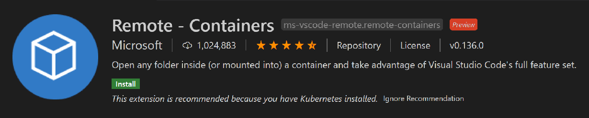
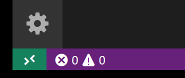
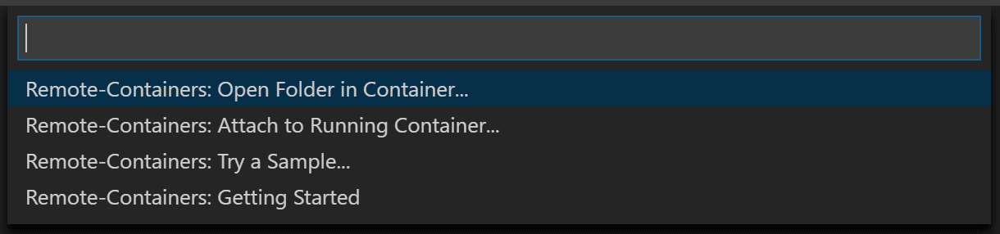
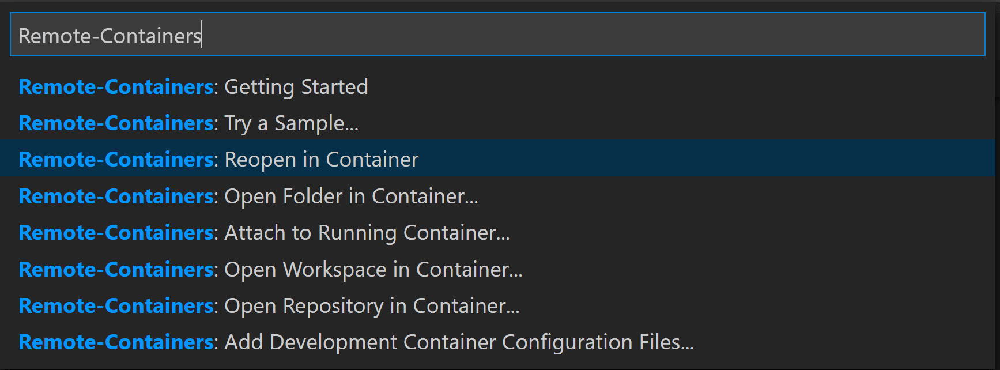

# Install the extension
From the VS code marketplace install the **Remote - Containers** extension which lets you run Visual Studio Code inside a Docker container.

# Get Started

- With the Remote - Containers extension installed, you will see a new Status bar item at the far left from which you can quickly check in which context VS Code is running (local or remote).

- clicking on the item will bring up the Remote - Containers commands. To open the 

- To build and connect to the dev container select the command **Remote-Containers: Reopen in Container command**

